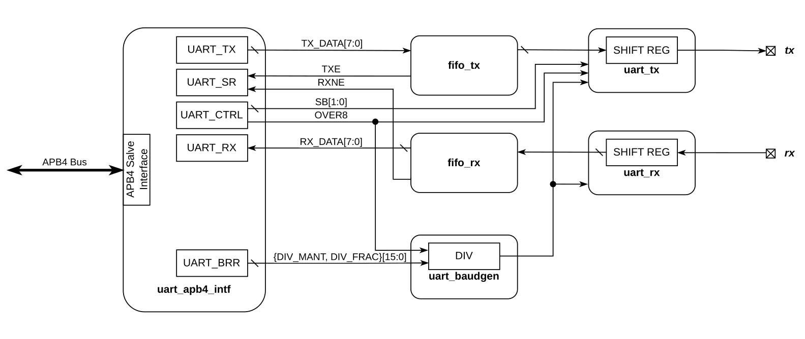
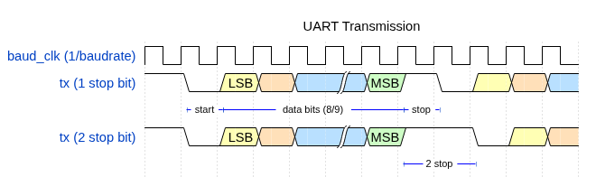
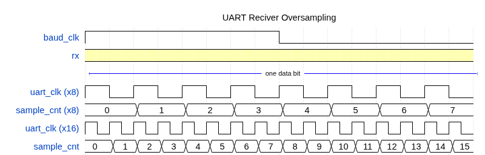
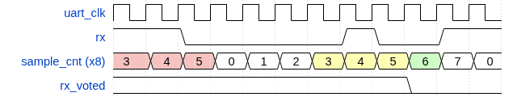
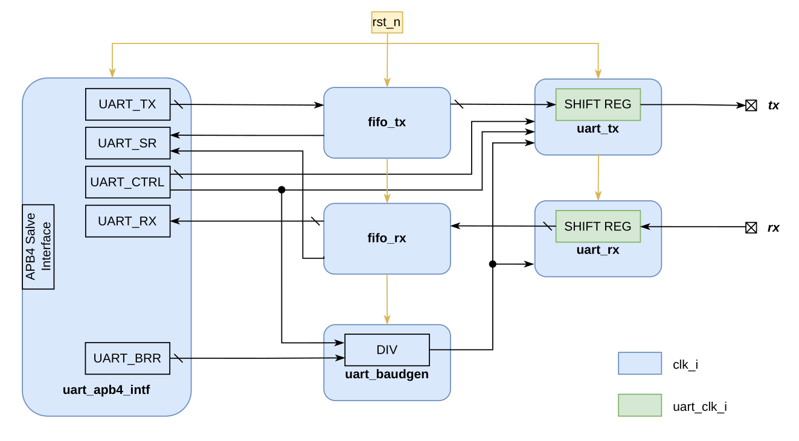

# uart_pl
**uart_pl** - периферийный IP-блок, который реализует последовательный интерфейс UART. Блок подключается PS через AXI APB Bridge, благодаря чему виден в адресном пространстве и может быть использован в программах, запускаемых на PS. 

## Микроархитектура

<figure align ="center">
  
  <figcaption>Блок-схема uart_pl</figcaption>
</figure>

Блок состоит из следующих функциональных модулей:
#### 1. **uart_apb4_intf**
Реализует протокол шины APB4 (slave) и содержит регистры управления, статуса и данных.

#### 2. **fifo**
* **`fifo_tx`**: Буферизирует данные от PS перед их отправкой
* **`fifo_rx`**: Накапливает полученные байты до момента их чтения PS

#### 3. **uart_baudgen**
Делитель частоты. Формирует скорость обмена по значению из регистра **UART_BRR**

#### 4. **UART drivers**
*   **`uart_tx`**: Пробразует байты в последовательный поток битов
*   **`uart_rx`**: Преобразует последовательный поток битов в байт

#### 5. **tx, rx** 
Порты ввода/вывода ПЛИС.

## Принцип работы 
Передача данных в UART осуществляется по одному биту за равные промежутки времени. Этот временной промежуток определяется заданной скоростью UART (baudrate). Длительность одного бита T = 1/baudrate.

В покое на линиях всегда логическая единица. Передатчик принудительно переводит линию в ноль (стартовый бит) и после этого передает биты данных (8 или 9), начиная с младшего. Передача завершается определенным количеством стоп-битов (логическая единица).

<figure align ="center">
  
  <figcaption>Передача с разным количеством стоп-битов</figcaption>
</figure>

В отсутствие тактирования приемник использует оверсэмплинг - многократного (относительно baudrate) измеряет уровня сигнала на линии  для определения значения бита.

<figure align ="center">
  
  <figcaption>8- и 16-кратный оверсэмплинг</figcaption>
</figure>

Для определения конкретного значения используется мажоритарное голосование. При фиксировании старт-бита приемник сбрасывает счетчик и регистрирует 3 значения rx по середине (для 8-кратного - на 3, 4 и 5 такте, для 16-кратного - на 7, 8 и 9). На следующем (6 или 10 соответственно) такте происходит голосование - результат выбирается большинством:

| Sampled value	| Received bit value |
| :---: | :---: |
|  000  |	  0   |
|  001  |	  0   |
|  010  |	  0   |
|  100  |	  0   |
|  101  |	  1   |
|  110  |	  1   |
|  111  |	  1   |

<figure align ="center">
  
  <figcaption>Мажоритарное голосование при 8-кратном оверсэмплинге</figcaption>
</figure>

## Характеристики блока
1. 8 бит данных;
2. Конфигурируемая программно скорость передачи: 9600, 19200, 38400, 57600, 115200 бод/с;
3. Конфигурируемое программно количество стоп-битов: 1, 2;
4. Конфигурируемый программно оверсэмплинг: x8, x16;
4. Две очереди (на отправку и получение) по 16 байт.

## Тактирование и организация сброса 

<figure align ="center">
  
  <figcaption>Блок-схема системы тактирования и сброса</figcaption>
</figure>

**`clk_i`** - тактовый сигнал от PLL PS (FCLK_CLK_x)

**`uart_clk_i`** - тактовый сигнал для сдвигового регистра от uart_baudgen

**`rst_n`** - общесистемный сброс для периферии

## Порты 

| Port | Width | Direction | Description |
| :--- | :---: | :--- | :--- |
| **Clock**     | | | | |
| clk_i         | 1  | input  |                                    |
| **Reset**     | |  |
| rst_n         | 1  | input  | Active low                         |
| **APB4 Bus**  | | | | |
| PADDR         | 32 | input  | Address                            |
| PSEL          | 1  | input  | Select                             |
| PENABLE       | 1  | input  | Enable                             |
| PWRITE        | 1  | input  | Direction (1 - write, 0 - read)    |
| PPROT         | 3  | input  | Protection type                    |
| PWDATA        | 32 | input  | Write data                         |
| PRDATA        | 32 | output | Read data                          |
| PSTRB         | 4  | input  | Write strobe                       |
| PREADY        | 1  | output | Ready                              |
| PSLVERR       | 1  | output | Transfer error                     |
| **UART**      | | | | |
| tx_o          | 1  | output | UART transmitter output pin        |
| rx_i          | 1  | input  | UART receiver input pin            |

## Регситры

## uart_apb4_intf address map

- Absolute Address: 0x0
- Base Offset: 0x0
- Size: 0x14

|Offset|Identifier|            Name           |
|------|----------|---------------------------|
| 0x00 |  UART_SR |    UART Status Register   |
| 0x04 |  UART_CR |   UART Control Register   |
| 0x08 |  UART_RX | UART Recieve Data Register|
| 0x0C |  UART_TX |UART Transmit Data Register|
| 0x10 | UART_BRR |  UART Baud Rate Register  |

### UART_SR register

- Absolute Address: 0x0
- Base Offset: 0x0
- Size: 0x4

|Bits|Identifier|Access|Reset|             Name            |
|----|----------|------|-----|-----------------------------|
|  0 |   RXFNE  |   r  | 0x0 | Receive data FIFO not empty |
|  1 |   TXFNF  |   r  | 0x1 | Transmit data FIFO not full |
| 6:2| RXFLEVEL |   r  | 0x0 | Receive data FIFO fill level|
|11:7| TXFSPACE |   r  | 0x10|Transmit data FIFO free space|

#### RXFNE field

Set by hw when rx_fifo is not empty.
UART_RX can be read

#### TXFNF field

Set by hw when tx_fifo is not full. 
UART_TX can be written

#### RXFLEVEL field

0: rx_fifo is empty;
1-15: bytes that are available for reading;
16: rx_fifo is full

#### TXFSPACE field

0: tx_fifo is full;
1-15: number of available slots for writing;
16: tx_fifo is empty

### UART_CR register

- Absolute Address: 0x4
- Base Offset: 0x4
- Size: 0x4

|Bits|Identifier|Access|Reset|       Name      |
|----|----------|------|-----|-----------------|
|  0 |    SB    |  rw  | 0x0 |    STOP bits    |
|  1 |   OVER8  |  rw  | 0x0 |Oversampling mode|

#### SB field

0: 1 stop bit;
1: 2 stop bits

#### OVER8 field

0: oversampling by 16;
1: oversampling by 8

### UART_RX register

- Absolute Address: 0x8
- Base Offset: 0x8
- Size: 0x4

|Bits|Identifier|Access|Reset|   Name   |
|----|----------|------|-----|----------|
| 7:0|  RX_DATA |   r  | 0x0 |Data value|

#### RX_DATA field

Contains the received data
character when the register is read

### UART_TX register

- Absolute Address: 0xC
- Base Offset: 0xC
- Size: 0x4

|Bits|Identifier|Access|Reset|   Name   |
|----|----------|------|-----|----------|
| 7:0|  TX_DATA |   w  | 0x0 |Data value|

#### TX_DATA field

Contains the data character to be
transmitted when the register is written to

### UART_BRR register

- Absolute Address: 0x10
- Base Offset: 0x10
- Size: 0x4

|Bits|Identifier|Access|Reset|          Name          |
|----|----------|------|-----|------------------------|
| 3:0| DIV_FRAC |  rw  | 0x0 |Fraction of UART Divider|
|15:4| DIV_MANT |  rw  | 0x0 |Mantissa of UART Divider|

#### DIV_FRAC field

These 4 bits define the fraction of the UART Divider

#### DIV_MANT field

These 12 bits define the mantissa of the UART Divider

## Настройка baudrate

Для настройки нужной скорости передачи в UART_BRR вносится целая (mantissa) и дробная (fraction) часть коэффициента деления UART Divider:

$$UART\_DIV = \frac{clk\_i}{8 \times (2 - OVER8) \times baudrate}$$

Допустим при clk_i = 100 Мгц необходим UART c baudrate = 115200 бод/c при оверсэплинге x16:

$$ \frac{100000000}{8 \times (2-0) \times 115200} \approx 54.25347...$$

Дробная часть (4 бита):

$$ 0.2534 \times 16 = 4.0544 \approx 4$$

Тогда в регистр UART_BRR нужно записать:

$$DIV\_FRAC = 54 = \text{0x36}$$

$$DIV\_MANT = 4 = \text{0x04}$$

$$UART\_BRR = (DIV\_MANT \ll 4) \ | \ DIV\_FRAC = \text{0x0364}$$

### Oversampling by 16 (OVER8 = 0)

| № | Baudrate, KBps | clk_i = 50 MHz (UART_DIV) | UART_BRR | clk_i = 100 MHz (UART_DIV) | UART_BRR |
| :--- | :--- | :--- | :--- | :--- | :--- |
| 1 | 9.6   | 325.5208 | `0x1458` | 651.0417 | `0x28B1` |
| 2 | 19.2  | 162.7604 | `0x0A2C` | 325.5208 | `0x1458` |
| 3 | 38.4  | 81.3802  | `0x0516` | 162.7604 | `0x0A2C` |
| 4 | 57.6  | 54.2535  | `0x0364` | 108.5069 | `0x06C8` |
| 5 | 115.2 | 27.1267  | `0x01B2` | 54.2535  | `0x0364` |
